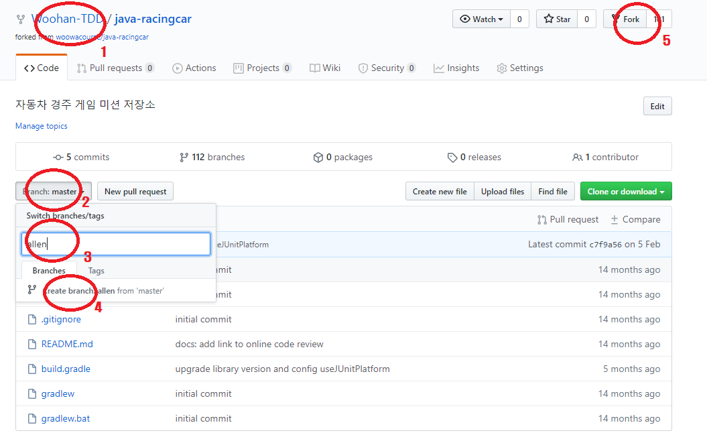
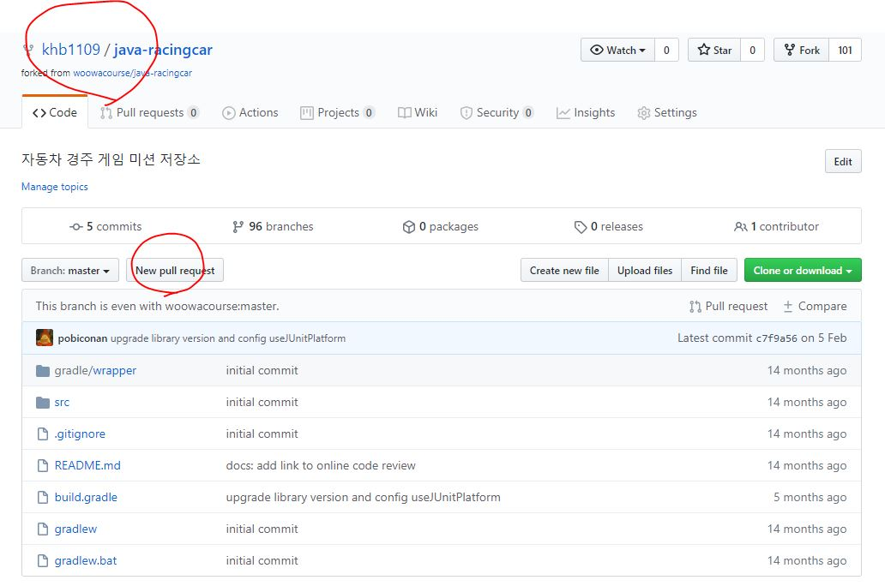
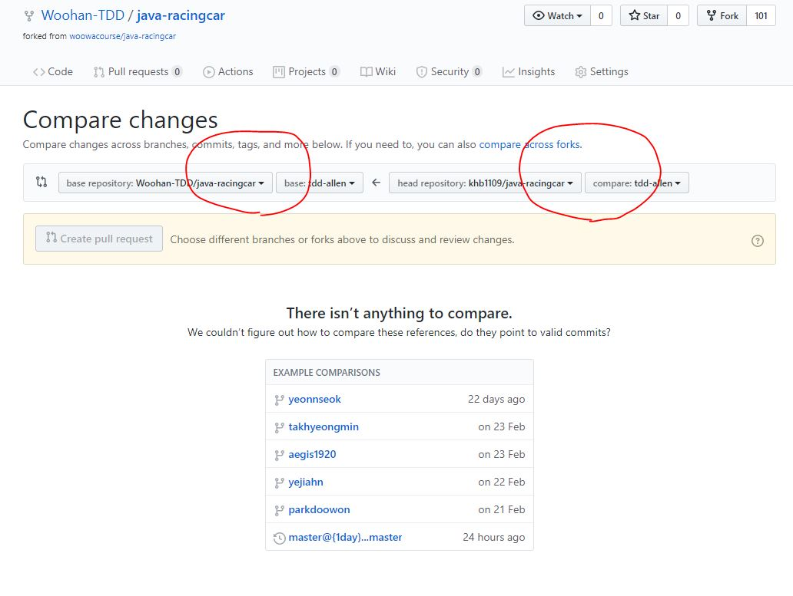

# docs


## 미션 진행방법

1. Woohan-TDD/Repository 이름을 확인한다.
2. 브랜치를 선택한다.
3. 새로운 브랜치를 만든다. 브랜치 이름은 tdd-<닉네임>으로 진행한다. 예) tdd-allen
   - 기존 브랜치와 중복을 피하기 위함이다. 
4. 클릭하여 새로운 브랜치를 만든다.
5. Fork 한다.
   - 우테코 미션이라서 따로 삭제하지 않았으면 새로 Fork되지는 않는다. 그러면 본인 저장소로 이용한다.
6. 본인 Repogitory에서 Clone 후 새로운 브랜치로 이동한다.

  ```
  $ git clone <origin-repository-url>
  $ git checkout -b tdd-allen
  ```
7. 미션을 진행한다.
8. Pull request를 진행한다. 

   - PR의 경우 [닉네임] <미션이름> 형식으로 제출한다. 

   - 예) [앨런] 자동차 경주미션 제출합니다.


## PR 확인진행방법.detail

1. 본인의 Origin 저장소인지 확인한다.
2. new pull request 버튼을 누른다.

---



1. base respository를 Woohan-TDD/<미션저장소>를 확인한다.
2. base branch를 본인이 만들었던, tdd-<닉네임>인지 확인한다.
3. 본인 origin 저장소 확인 및 브랜치를 확인한다.

---